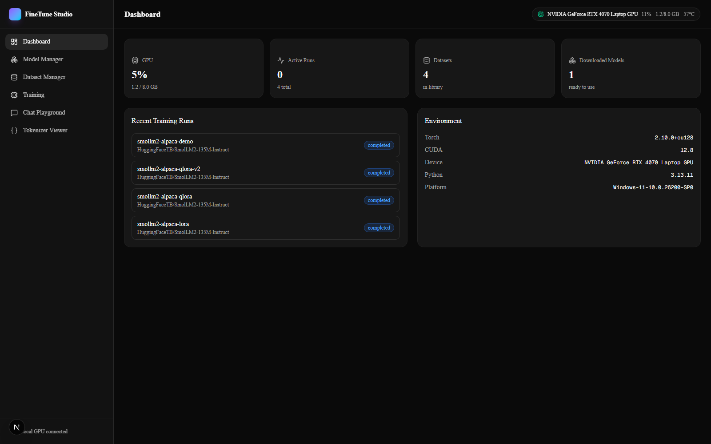
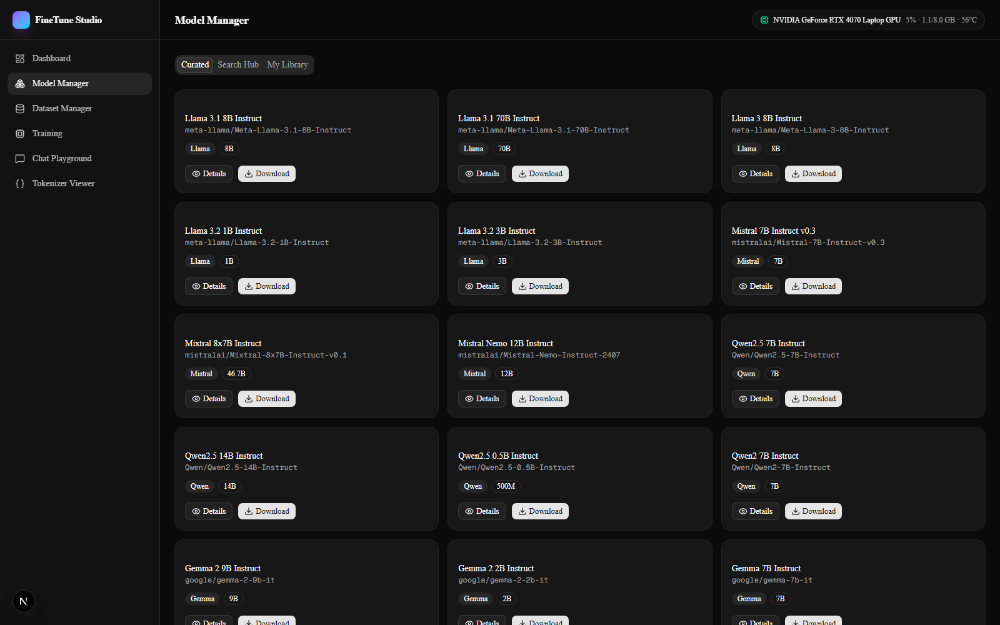
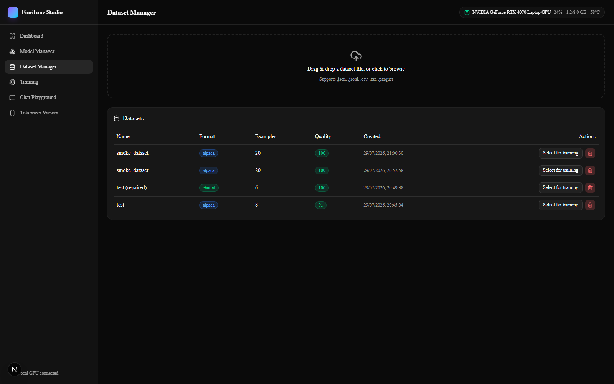
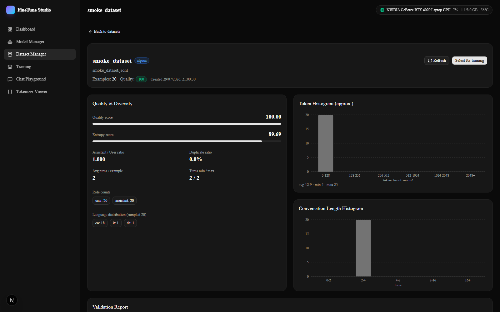
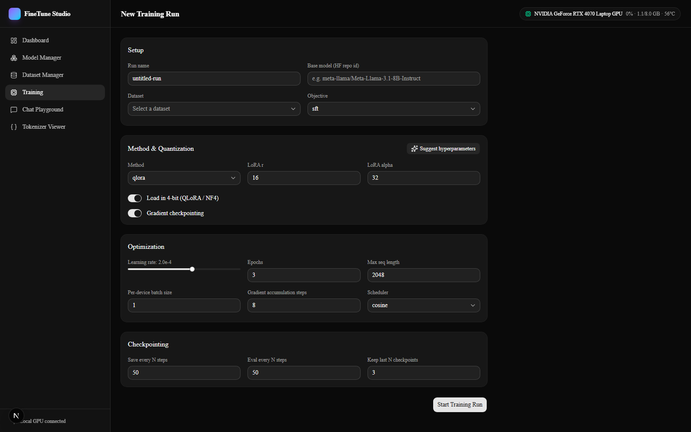
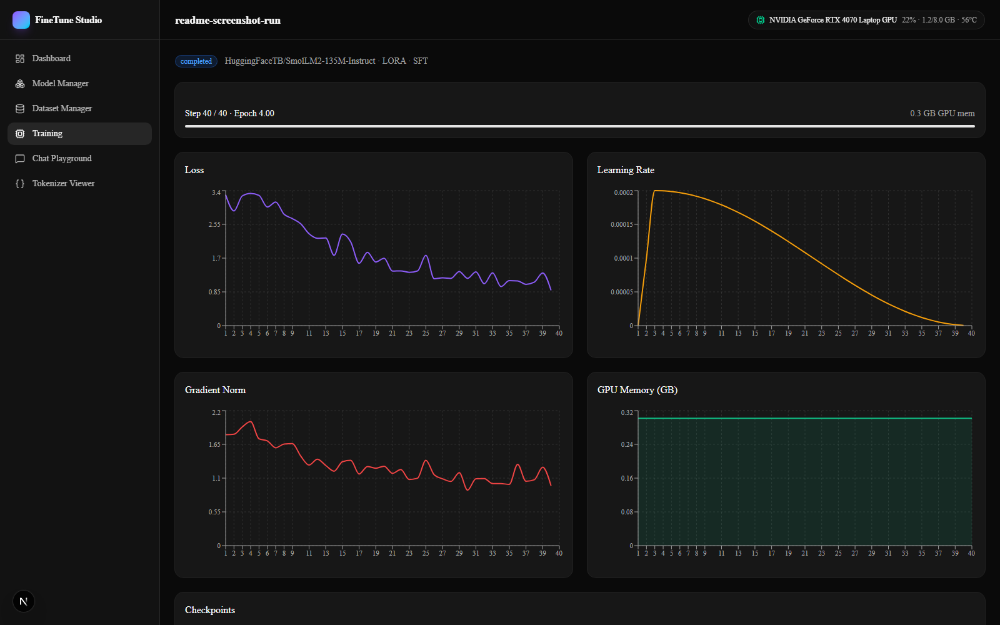
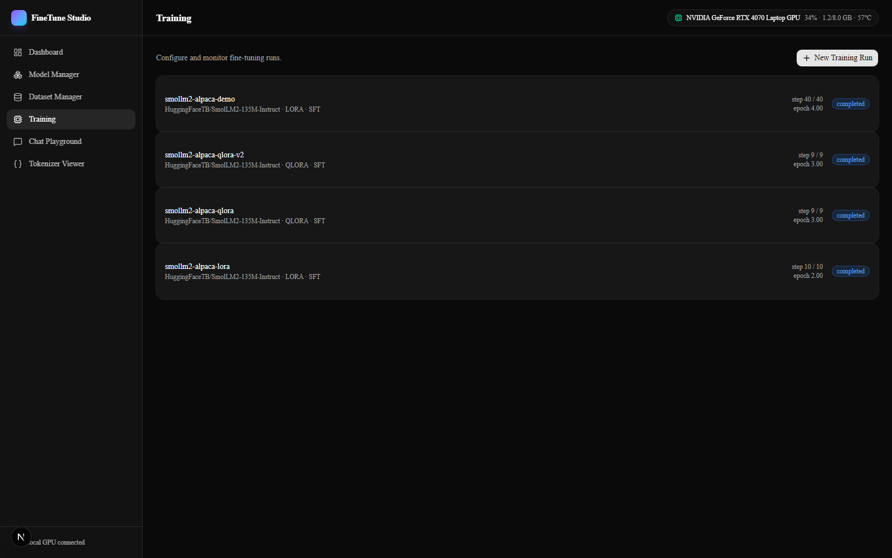
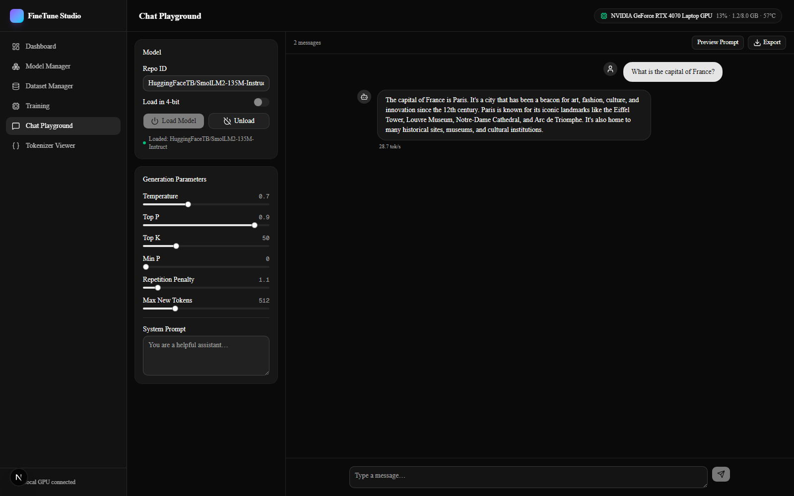
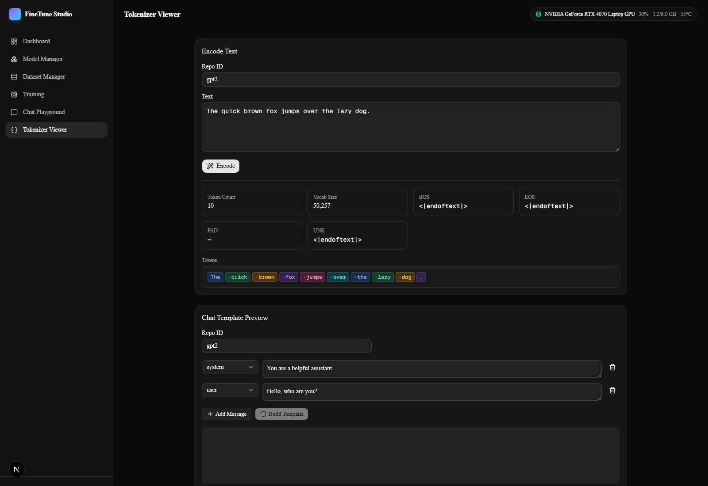

# FineTune Studio

**A local, full-stack platform for training, fine-tuning, evaluating, and serving LLMs — in one UI.**

FineTune Studio replaces the usual scattered toolbox — Unsloth scripts, LLaMA Factory configs, raw TRL/PEFT code, `nvidia-smi` in a second terminal, a separate Ollama model manager — with a single dashboard: browse and download models, upload and validate datasets, configure and launch a real fine-tuning run, watch it train live, then merge, export, and chat with the result. It runs entirely on your own machine and your own GPU.

Built and verified end-to-end on an **RTX 4070 Laptop GPU (8GB VRAM)** with a real LoRA fine-tuning run — see [Verified end-to-end](#verified-end-to-end) below.

---

## Screenshots

### Dashboard
Live GPU telemetry, recent training runs, environment/dependency diagnostics at a glance.



### Model Manager
Curated model catalog across Llama, Mistral, Qwen, Gemma, Phi, DeepSeek, and vision models, plus live HuggingFace Hub search and a per-model VRAM estimator.



### Dataset Manager
Drag-and-drop upload with automatic format detection (Alpaca / ShareGPT / ChatML / preference pairs / raw text).



Per-dataset quality score, entropy, token/turn histograms, validation report, and tokenizer-aware preview:



### Training
Every hyperparameter exposed, with one-click hyperparameter suggestions sized to your GPU's VRAM:



Live training dashboard — real loss/learning-rate/gradient-norm/GPU-memory curves streamed over WebSocket, with gradient explosion/vanishing detection:



All runs at a glance:



### Chat Playground
Load any local or downloaded model (including your own fine-tuned adapters) and chat with streaming generation, full sampling controls, and a prompt inspector.



### Tokenizer Viewer
Inspect exactly how any HuggingFace tokenizer segments text, and preview chat-template formatting.



---

## What's implemented

This is a real, working implementation of the highest-value slice of a much larger spec (the original brief asked for feature parity with Unsloth + LLaMA Factory + Axolotl + TRL + PEFT + bitsandbytes + Ollama combined, across dozens of model families and every quantization/export format). Rather than stub out that entire surface, this build goes deep on the core fine-tuning loop and keeps the architecture open to extend into the rest. See [Scope decisions](#scope-decisions) for what's deliberately out.

### Backend (FastAPI, `backend/`)

| Service | What it does |
|---|---|
| **Model Service** | HuggingFace Hub search, a 25-model curated catalog (Llama 3/3.1, Mistral/Mixtral, Qwen2/2.5, Gemma/Gemma2, Phi-3/Phi-4, DeepSeek, Yi, TinyLlama, LLaVA, Qwen2-VL), config-based architecture inspection (hidden size, layers, heads, context length), a VRAM estimator across full/LoRA/QLoRA × fp16/bf16/int8/nf4, background downloads, bookmarks & library |
| **Dataset Service** | Upload JSON/JSONL/CSV/TXT/Parquet, auto-detect format (Alpaca, ShareGPT, ChatML, OpenAI, Llama-text, preference pairs), validation (missing fields, role mismatches, duplicates, empty responses, broken UTF-8, unsupported tokens), stats (token & turn histograms, quality score, entropy score, language distribution), tokenizer-aware preview with real chat-template rendering, auto-repair (fix roles, merge/split turns, dedupe, truncate, shuffle) |
| **Training Service** | LoRA / QLoRA / DoRA / full fine-tuning via PEFT; SFT / DPO / KTO via TRL. Each run executes in its **own OS subprocess** (`app/workers/train_worker.py`), so a CUDA OOM or crash in one job can never take down the API server or other runs. Progress streams back through a JSONL status file into SQLite and a live WebSocket |
| **GPU / System Service** | Real NVML-based GPU telemetry (VRAM, temperature, power draw, utilization, fan speed), CPU/RAM/disk usage, polled and broadcast over WebSocket every ~1.5s; a dependency/CUDA diagnostics endpoint |
| **Checkpoint Service** | Checkpoint listing, best-checkpoint selection by eval loss, LoRA merge-and-unload, safetensors export, best-effort GGUF export (via an external llama.cpp install), automatic checkpoint cleanup |
| **Inference Service** | Single-model-resident chat backend with Server-Sent-Events token streaming and a generation benchmark (tokens/sec, time-to-first-token, peak VRAM) |
| **Tokenizer Service** | Token-level inspection, vocabulary lookup, chat-template rendering |

### Frontend (Next.js 16 + TypeScript + Tailwind v4 + shadcn/ui + Zustand + Recharts, `frontend/`)

Dashboard · Model Manager (curated / search / library tabs, VRAM estimator, detail sheet) · Dataset Manager (upload, stats charts, validation report, tokenizer preview, auto-repair) · Training (hyperparameter-suggestion config form, live WebSocket dashboard with loss/LR/grad-norm/GPU-mem charts and gradient-anomaly alerts, checkpoint export) · Chat Playground (streaming chat, prompt inspector, full sampling controls) · Tokenizer Viewer.

Dark theme by default, fully responsive dashboard layout, real-time updates throughout (no manual refresh needed while a job is running).

## Architecture

```
┌─────────────────────┐         ┌──────────────────────────────────────┐
│   Next.js frontend   │  HTTP   │            FastAPI backend           │
│  (dashboard, forms,  │◄───────►│  model / dataset / checkpoint /      │
│   live charts, chat) │   WS    │  inference / gpu / tokenizer routes  │
└─────────────────────┘         └───────────────┬──────────────────────┘
                                                 │ subprocess per run
                                                 ▼
                                  ┌───────────────────────────────┐
                                  │   app/workers/train_worker.py │
                                  │  (PEFT + TRL, on your GPU)    │
                                  │  writes status.jsonl ─────────┼──► tailed back into
                                  └───────────────────────────────┘    SQLite + WebSocket
```

Training runs in an **isolated OS process**, not inside the API server. This means:
- A CUDA out-of-memory error or a crash in one training job never takes the API or other jobs down with it.
- The API server stays responsive (GPU telemetry, other endpoints) while a training run saturates the GPU.
- Progress is communicated back through a simple append-only JSONL file, tailed by an asyncio task that updates SQLite and fans out to any connected WebSocket clients.

## Verified end-to-end

This isn't a mock-data demo. A real LoRA fine-tuning run was executed through the actual running API, on the actual GPU:

- **Model:** `HuggingFaceTB/SmolLM2-135M-Instruct`
- **Dataset:** a 20-example Alpaca-format instruction dataset, uploaded through the real upload endpoint and auto-detected correctly
- **Run:** LoRA (r=8), SFT, 4 epochs / 40 steps, on an RTX 4070 Laptop GPU
- **Result:** loss dropped from ~3.3 to ~0.9 over the run (see the training dashboard screenshot above — that chart is the real logged data, not a mock), checkpoints saved every 4 steps, adapter merged back into a full-precision model, safetensors export produced real, loadable weights (~269MB), and the merged model was then loaded into the Chat Playground and produced a real streamed response.

Along the way this surfaced and fixed two genuine environment bugs, documented in [Scope decisions](#scope-decisions): a `huggingface_hub` API mismatch in Hub search, and a newer-TRL-version incompatibility (`max_seq_length` → `max_length` rename, and `ORPOTrainer` having been removed upstream).

## Prerequisites

- **Python 3.11+** with a CUDA-capable environment. Developed against a conda environment with:
  `torch` (cu12x build), `transformers`, `peft`, `trl`, `accelerate`, `bitsandbytes`, `datasets`, `huggingface_hub`, `fastapi`, `uvicorn`, `sqlmodel`, `aiosqlite`, `nvidia-ml-py`, `psutil`, `pyarrow`, `langdetect`.
- **Node.js 20+** for the frontend.
- An NVIDIA GPU is expected for actually training/running inference; the API and UI run fine without one (GPU panels just show "no data" and training/inference endpoints will error clearly if no CUDA device is available).

## Getting started

### 1. Clone and set up the backend

```bash
git clone <your-repo-url> finetune-studio
cd finetune-studio/backend

# create/activate a CUDA-enabled Python environment first, then:
pip install -r requirements.txt

uvicorn app.main:app --reload --port 8321
```

The SQLite database, uploaded datasets, checkpoints, and model cache are all created automatically under `backend/data/` on first run — nothing to configure.

### 2. Set up the frontend

```bash
cd finetune-studio/frontend
npm install
```

Create `frontend/.env.local`:

```
NEXT_PUBLIC_API_BASE_URL=http://127.0.0.1:8321
```

(adjust the port to match whatever you started uvicorn on)

```bash
npm run dev
```

### 3. Open the app

Go to **http://localhost:3000**. Start on the Dataset Manager to upload a dataset, the Model Manager to pick a base model, then Training → New Training Run to configure and launch a job. Watch it train live on the run's detail page.

## Repository layout

```
backend/
  app/
    api/routes/        FastAPI route modules (one per service)
    services/           business logic (dataset parsing, training orchestration, GPU polling, ...)
    workers/
      train_worker.py   standalone script executed as a subprocess per training run
    models/db.py        SQLModel table definitions
    schemas/            Pydantic request/response schemas
    core/                config, DB session, in-process event bus
  requirements.txt
frontend/
  src/
    app/                Next.js App Router pages (one folder per top-level route)
    components/         shared UI components, organized by feature area
    lib/api/            typed fetch client + endpoint wrappers matching the backend exactly
    store/              Zustand app-wide state (selected model/dataset/run)
docs/screenshots/        the images used in this README
```

## Scope decisions

The original brief this was built from asked for feature parity with Unsloth, LLaMA Factory, Axolotl, TRL scripts, PEFT, bitsandbytes utilities, and Ollama's model manager combined — dozens of model families, every training method (SFT/DPO/IPO/ORPO/KTO/PPO/GRPO/reward modeling), every quantization format (GPTQ/AWQ/GGUF/EXL2/HQQ), full VLM training, MMLU/HumanEval-style eval suites, W&B/MLflow/TensorBoard integration, a React Flow pipeline editor, ONNX/TensorRT export, and DeepSpeed/multi-GPU distributed training.

Building all of that to a real, working standard in one pass isn't feasible, so this build prioritizes **depth over breadth** on the core loop — upload data, pick a model, train it, watch it train, export it, talk to it — and leaves the rest as natural extension points on top of the same service architecture. Specifically:

- **8GB-VRAM-first defaults.** Hyperparameter suggestions, LoRA rank defaults, and batch-size heuristics assume a single consumer GPU. Full fine-tuning of models beyond ~1-2B parameters, and multi-GPU/DeepSpeed training, aren't practical on that hardware and aren't wired up — though the config schema has room for them.
- **ORPO is not available.** The installed TRL version (1.9.2) removed `ORPOTrainer`/`ORPOConfig` upstream after they existed in earlier releases. SFT, DPO, and KTO are all fully implemented and tested; ORPO is disabled with a clear error rather than silently failing, and isn't offered in the UI's objective picker.
- **GGUF export** depends on an external [llama.cpp](https://github.com/ggerganov/llama.cpp) checkout with `convert_hf_to_gguf.py` on `PATH`. Without it, the export endpoint returns a clear, actionable error instead of failing silently. Safetensors export (merge LoRA into a full model) works standalone with no external dependency.
- **Evaluation suites** (MMLU, HumanEval, MT-Bench, etc.), **experiment tracking integrations** (W&B, MLflow), and the **visual pipeline editor** are not implemented in this pass.
- **VLM (vision-language model) training** is not implemented, though vision models are browsable/downloadable in the Model Manager and flagged as such.

---
Made with ❤️ from NiceGuy
